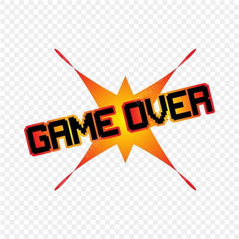

# 🍎 Catch the Objects!

A fun, fast-paced arcade game built with Python and Pygame. Catch the falling apples to score points, but avoid the bombs at all costs!



## 🎮 Features

- **Progressive Levels**: The game gets faster and more challenging as your score increases (Level up every 20 points!).
- **High Score Tracking**: Automatically saves your best performance to `highscore.txt`.
- **Dynamic Backgrounds**: Experience five different environments as you advance through levels.
- **Sound Effects**: Immersive audio for catching objects and explosions, plus background music.
- **Responsive Controls**: Smooth basket movement for a fluid gaming experience.

## 🕹️ How to Play

### Controls

- **Left Arrow**: Move Basket Left
- **Right Arrow**: Move Basket Right
- **Space**: Start Game (from Menu)
- **R**: Restart Game (after Game Over)
- **Q**: Quit Game

### Objective

1. Catch the **Apples** to increase your score.
2. Avoid the **Bombs**. Each bomb hit costs you 1 life.
3. You start with **3 Lives**. The game ends when you lose all of them.

## 🚀 Installation & Setup

### Prerequisites

- Python 3.x
- Pygame library

### Quick Start

1. **Clone the repository**:

   ```bash
   git clone https://github.com/sameer9860/Catch-The-Object.git
   cd Catch-The-Object
   ```

2. **Install dependencies**:

   ```bash
   pip install -r requirements.txt
   ```

3. **Run the game**:
   ```bash
   python catch-the-object.py
   ```


## 📜 License

This project is open-source and available for everyone. Enjoy catching!
